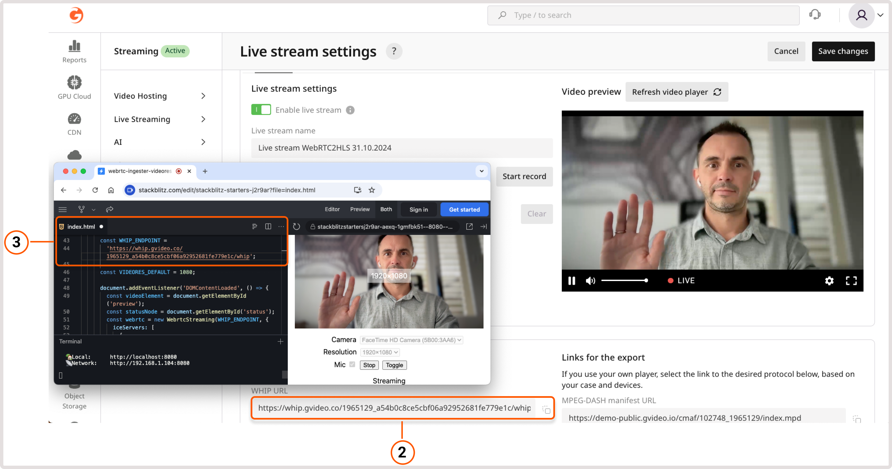
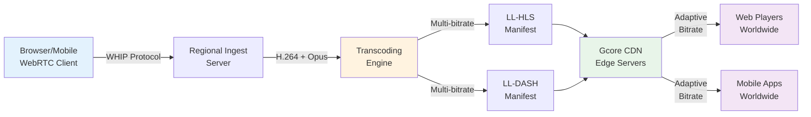
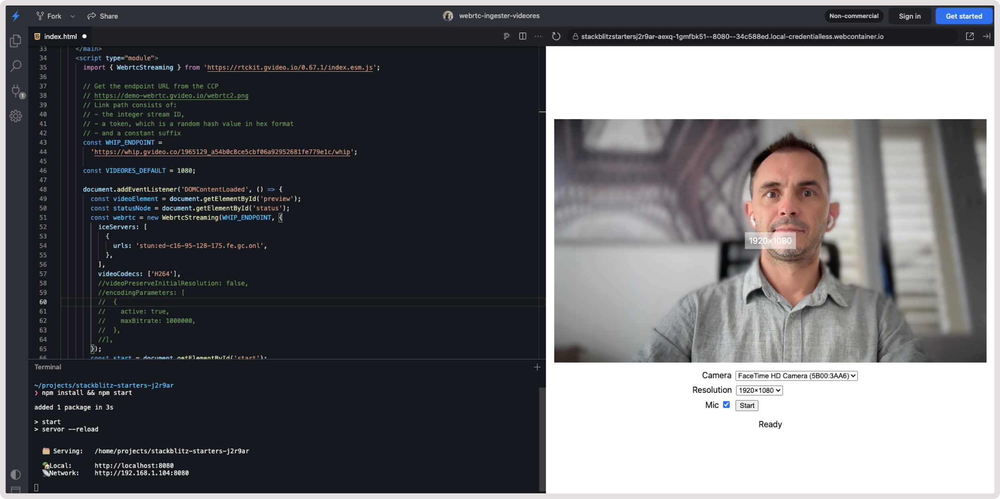

# Gcore WebRTC SDK

**Browser-native live streaming** powered by WebRTC WHIP protocol. Stream directly from browsers to global audiences via Gcore's CDN infrastructure with adaptive bitrate delivery.

[](https://stackblitz.com/edit/stackblitz-starters-j2r9ar?file=index.html)

---

## 🎯 What This SDK Does

Enables **real-time video/audio streaming** from web browsers to millions of viewers with:
- **No software installation** - Works directly in Chrome, Firefox, Safari
- **Global CDN delivery** - Automatic transcoding to HLS/DASH with adaptive bitrate
- **Low latency** - 2-4 seconds glass-to-glass delay
- **Mobile-ready** - Stream from any device with a camera

**Built on**: WebRTC WHIP (HTTP Ingestion Protocol) + Gcore Streaming Platform

---

## 📊 How It Works

### Overview: WebRTC WHIP Protocol

WHIP (WebRTC HTTP Ingestion Protocol) is an **open standard** for browser-based live streaming that uses simple HTTP signaling instead of complex WebSocket connections.

```
┌──────────────┐      WHIP/HTTP       ┌─────────────────┐
│   Browser    │ ──────────────────► │  Gcore Ingest   │
│  (Camera +   │   WebRTC Media      │   Servers       │
│   Mic)       │ ──────────────────► │  (Regional)     │
└──────────────┘                      └─────────────────┘
```

### Complete Gcore Workflow



### Step-by-Step Process

1. **📹 Ingest** - Browser captures camera/mic → Sends via WebRTC WHIP to nearest Gcore server
2. **⚙️ Transcode** - Server converts WebRTC stream → Multiple quality levels (ABR)
3. **🌐 Distribute** - CDN delivers HLS/DASH streams → Edge servers worldwide
4. **📺 Playback** - Viewers watch via standard video players of LL-HLS/LL-DASH (hls.js, dash.js, native)

**Latency**: 2-4 seconds (Low-Latency HLS/DASH)

---

## 🚀 Quick Start for Developers

**New to the SDK?** Start with these resources optimized for AI-assisted development:

- **[AI Development Guide](./AI_DEVELOPMENT_GUIDE.md)** - Build with AI assistants (Claude, Copilot, Cursor)
- **[Working Examples](./examples/AI_USAGE_EXAMPLES.md)** - Complete, runnable code examples
- **[Common Patterns](./examples/COMMON_PATTERNS.md)** - Copy-paste code snippets
- **[Technical Docs](./DOCS.md)** - Architecture and API reference

### 5-Minute Demo to send live stream via WebRTC WHIP

```javascript
import { WebrtcStreaming } from 'https://rtckit.gvideo.io/0.89.12/index.esm.js';

// 1. Initialize with your WHIP endpoint
const webrtc = new WebrtcStreaming('https://whip.gvideo.co/YOUR_STREAM/whip', {
  videoCodecs: ['H264'],
  mediaDevicesAutoSwitch: true,
});

// 2. Get camera/mic
const stream = await webrtc.openSourceStream({ video: true, audio: true });

// 3. Preview locally
await webrtc.preview(videoElement);

// 4. Start streaming
const client = await webrtc.run();

// 5. Handle events
client.on('connected', () => console.log('🔴 Live'));
client.on('disconnected', () => console.log('Reconnecting...'));
```

**Try it live**: [Interactive Stackblitz Demo](https://stackblitz.com/edit/stackblitz-starters-j2r9ar?file=index.html)

---

## 💡 Real-World Use Cases

### 1. **Web-Based Live Events**
**Scenario**: Online conferences, webinars, training sessions
**Why WHIP**: Presenters stream directly from browsers without installing OBS or other software. Instant setup, professional delivery.

### 2. **User-Generated Content Platforms**
**Scenario**: Social platforms, marketplaces, community sites
**Why WHIP**: Enable users to go live instantly from your website. No app downloads, no technical barriers.

### 3. **Restricted-App Environments**
**Scenario**: Age-restricted content, private communities, regulated industries
**Why WHIP**: Perfect for scenarios where mobile app distribution faces platform restrictions. Users stream directly via web interface bypassing app store policies.

### 4. **Emergency Broadcasting**
**Scenario**: Breaking news, crisis communication, field reporting
**Why WHIP**: Journalists/responders stream immediately from any browser. No special equipment needed—just a phone and internet.

### 5. **E-Commerce Live Shopping**
**Scenario**: Product demonstrations, flash sales, influencer marketing
**Why WHIP**: Sellers showcase products live with instant interaction. Seamless integration into existing web storefronts.

### 6. **Remote Expert Consultations**
**Scenario**: Telemedicine, legal advice, technical support
**Why WHIP**: Professionals stream consultations with secure, low-latency delivery. Browser-based = no software training required.

### 7. **Gaming & Esports**
**Scenario**: Tournament broadcasts, gameplay sharing, community events
**Why WHIP**: Streamers broadcast from web portals, viewers get adaptive quality for different connection speeds.

---

## 🎯 Why Choose WebRTC WHIP?

### Comprehensive Protocol Comparison

Understanding the right tool for your use case: Pure WebRTC, Gcore's Hybrid Approach, or Traditional Protocols.

| Feature | Pure WebRTC (P2P/SFU) | Gcore WHIP → HLS/DASH | RTMP/SRT |
|---------|----------------------|---------------------------|----------|
| Ingestion Method | WebRTC P2P/SFU | WebRTC WHIP | RTMP/SRT Push |
| Encoder Software | Browser only | Browser only | ⚠️ OBS, Larix, etc. |
| Ingestion Latency | 200-500ms | 200-500ms | 1-3 seconds |
| End-to-End Latency | 200-500ms | 2-4 seconds | 10-30 seconds |
| Max Concurrent Viewers | ~100-500 (SFU limit) | Unlimited (CDN) | Unlimited (CDN) |
| Viewer Device Support | Modern browsers only | All devices | All devices |
| Adaptive Bitrate | Limited (per connection) | Multi-profile ABR | Multi-profile ABR |
| Bandwidth Cost Model | Linear per viewer | Fixed ingestion + CDN | Fixed ingestion + CDN |
| Infrastructure Complexity | High (SFU, TURN, clusters) | Managed by Gcore | Moderate (CDN config) |
| NAT/Firewall Issues | TURN support needed | None (HTTP delivery) | None (HTTP delivery) |
| User Barrier | Low | Very low | High |
| Security | DTLS-SRTP | DTLS-SRTP + HTTPS | RTMPS/TLS |

### When to Use Each Approach

#### Pure WebRTC (P2P/SFU) ✅ Best For:
- **Video conferencing** - 2-50 participants, bidirectional audio/video
- **Interactive gaming** - Sub-500ms latency is critical
- **Real-time collaboration** - Screen sharing, whiteboards
- **Small broadcasts** - <100 viewers, audience participation required

**Limitations**: Doesn't scale beyond hundreds of viewers, complex infrastructure, NAT/firewall issues

#### Gcore WHIP → HLS/DASH 🚀 Best For:
- **Live events** - Concerts, sports, conferences (1,000-1,000,000 viewers)
- **Social streaming** - Unpredictable audience size, global reach
- **E-commerce live** - Product demos, flash sales, influencer marketing
- **Mobile-first platforms** - Native HLS support on iOS/Android
- **Smart TV apps** - HLS/DASH standard on all platforms
- **Cost-sensitive scaling** - Predictable CDN pricing vs per-connection SFU costs

**Sweet Spot**: Browser-native ingestion + unlimited scalability + 2-4s latency is acceptable

#### RTMP/SRT 📺 Best For:
- **Professional broadcasting** - Existing OBS workflows, advanced production
- **Legacy systems** - Integration with traditional broadcast equipment
- **Multi-platform streaming** - Restream to YouTube, Twitch, Facebook simultaneously

**Drawbacks**: Requires software installation, longer latency (10-30s), technical setup barrier

**Learn more**: [Traditional live streaming with RTMP/SRT →](https://gcore.com/docs/streaming/live-streaming/create-a-live-stream)

### Technical Deep-Dive: Architecture Comparison

#### Pure WebRTC Challenge: The Scaling Problem

```
Broadcaster
    ↓ (WebRTC P2P or SFU connection)
   SFU Server ──→ Viewer 1 (dedicated WebRTC connection)
      ├────────→ Viewer 2 (dedicated WebRTC connection)
      ├────────→ Viewer 3 (dedicated WebRTC connection)
      └────────→ ... (100+ connections = bottleneck)
```

**Fundamental Issues**:
- **CPU intensive**: SFU must decrypt/encrypt/process every viewer connection separately
- **Bandwidth bottleneck**: N viewers = N × bitrate from SFU server
- **Scaling complexity**: Requires SFU clusters, load balancers, TURN server infrastructure
- **NAT traversal failures**: 10-15% of corporate/university networks block WebRTC
- **Cost explosion**: Per-connection processing = linear cost growth with audience size

**Example**: 1,000 viewers × 2 Mbps = 2 Gbps egress from single SFU (prohibitively expensive)

#### Gcore's Hybrid Solution: Best of Both Worlds

```
Broadcaster (Browser)
    ↓ (WebRTC WHIP - 200-500ms)
Regional Ingest Server (closest to broadcaster)
    ↓ (Transcoding - 1-2 seconds, happens once)
Multi-Bitrate Profiles (1080p, 720p, 480p, 360p, 240p)
    ↓
CDN Edge Network (140+ global locations)
    ↓ (HLS/DASH segments cached at edge)
Millions of Viewers (standard HTTP, no WebRTC needed)
```

**Why This Works**:
1. **Fast ingestion**: WebRTC WHIP gets broadcaster's stream to nearest server quickly (200-500ms)
2. **Transcode once**: Server generates multiple bitrate profiles at ingestion point (not per-viewer)
3. **HTTP delivery**: CDN serves HLS/DASH segments via standard HTTP (infinitely scalable)
4. **Edge caching**: Popular segments cached at CDN edge (low latency for viewers globally)
5. **Universal compatibility**: Every device speaks HTTP + HLS/DASH (no WebRTC client needed)
6. **Cost efficiency**: Single ingestion + CDN bandwidth vs thousands of SFU connections

**Latency Breakdown (Glass-to-Glass)**:
```
WebRTC WHIP ingest:        200-500ms  (broadcaster → Gcore)
Transcoding + segmentation: 1-2 seconds (encode ABR profiles)
CDN edge propagation:       500ms-1s   (origin → edge cache)
Player buffering:           500ms      (smooth playback)
────────────────────────────────────────────────────────
Total End-to-End:          2.5-4 seconds
```

**Compare to**:
- Pure WebRTC: **200-500ms** (but max ~100-500 viewers before infrastructure fails)
- RTMP/SRT → HLS: **10-30 seconds** (traditional HLS segmentation)

### Real-World Cost Comparison

**Scenario**: 10,000 concurrent viewers watching 2 Mbps stream

| Approach | Infrastructure | Cost Level | Scaling Difficulty |
|----------|---------------|------------|-------------------|
| Pure WebRTC SFU | 20 Gbps SFU egress + TURN servers | High | Very High |
| Gcore WHIP → HLS/DASH | Single ingestion + CDN | Low | Automatic |
| RTMP → CDN | Single ingestion + CDN | Low | Low |

**Key Insight**: Pure WebRTC cost grows linearly with viewers. Gcore's hybrid approach costs stay flat regardless of audience size.

### Technical Advantages of Gcore WHIP

- **🌍 Regional Ingest** - Auto-connects to nearest of 140+ edge locations (minimizes ingestion latency)
- **🔄 Auto-Reconnection** - Transparent ICE restart on network hiccups (no stream interruption)
- **📱 Device Hot-Swapping** - Change cameras/mics mid-stream without reconnecting
- **📊 Quality Monitoring** - Real-time bitrate, resolution, packet loss tracking via plugins
- **🔐 End-to-End Security** - DTLS-SRTP for ingestion + HTTPS for CDN delivery
- **🌐 CDN-Powered Distribution** - 210+ global edge servers, unlimited concurrent viewers
- **💰 Predictable Costs** - Single ingestion fee + CDN bandwidth (no per-viewer charges)
- **📺 Universal Playback** - HLS/DASH works on iOS, Android, Smart TVs, browsers, set-top boxes
- **🎯 Adaptive Quality** - Multi-bitrate profiles auto-adjust to viewer's connection speed
- **⚡ Browser-Native** - Zero software installation for broadcasters (click "Go Live" and stream)

---

## 📦 Packages

### Browser SDK: [@gcorevideo/rtckit](./packages/rtckit/)

**For**: Client-side streaming (browsers, Electron apps)

```bash
npm install @gcorevideo/rtckit
```

**Features**:
- WHIP client implementation
- Media device management (cameras, mics, screen sharing)
- Automatic reconnection & ICE restart
- Quality monitoring plugins
- Error handling & recovery

[📖 Browser SDK Documentation →](./packages/rtckit/README.md)

---

### Server SDK: [@gcorevideo/rtckit-node](./packages/rtckit-node/)

**For**: Backend stream management (Node.js)

```bash
npm install @gcorevideo/rtckit-node
```

**Features**:
- Create/delete streams via Gcore API
- Generate WHIP URLs for clients
- List active streams
- Retrieve playback URLs (HLS/DASH)

[📖 Server SDK Documentation →](./packages/rtckit-node/README.md)

**Example**:
```javascript
import { ApiKey, GcoreApi } from '@gcorevideo/rtckit-node';

const api = new GcoreApi(new ApiKey(process.env.GCORE_API_KEY));

// Create stream
const stream = await api.webrtc.createStream('My Live Event');
console.log('WHIP URL:', stream.whipUrl);  // Send to browser
console.log('Playback:', stream.hlsUrl);    // Embed in video player

// Delete when done
await api.webrtc.deleteStream(stream.id);
```

---

## 🎬 Example Applications

### Interactive Demos

**[Live Streaming Demo](https://stackblitz.com/edit/stackblitz-starters-j2r9ar)** - Minimal HTML/JS example



**[Full-Stack Nuxt App](https://gcore-webrtc-sdk-js-nuxt.vercel.app/)** - Complete application with server-side stream management

### Architecture Examples

**Simple**: Browser → WHIP Endpoint (no server needed)
```
User opens webpage → Clicks "Go Live" → Streams to Gcore → Viewers watch
```

**Advanced**: Full-stack application
```
User clicks "Go Live" → Your backend creates stream → Returns WHIP URL →
Browser streams → Gcore transcodes → CDN delivers → Your backend tracks analytics
```

---

## 🔧 Technical Details

### Stream Requirements

**Video**: H.264 codec (baseline profile, 1-second keyframe interval, no B-frames)
**Audio**: Opus codec
**Bitrate**: 1-2 Mbps recommended for presentations, 3-5 Mbps for high-motion content
**Resolution**: 240p to 1080p (adaptive bitrate automatically generated)

### Output Formats

- **LL-HLS** (Low-Latency HLS): 3-4 seconds latency, broad device support
- **LL-DASH** (Low-Latency MPEG-DASH): 2-4 seconds latency, modern browsers
- **HLS MPEG-TS**: 10+ seconds latency, legacy compatibility

### Browser Compatibility

| Browser | Support | Notes |
|---------|---------|-------|
| Chrome 89+ | ✅ Full | Recommended |
| Firefox 88+ | ✅ Full | Recommended |
| Safari 14.1+ | ✅ Full | iOS 14.5+ |
| Edge 89+ | ✅ Full | Chromium-based |

---

## 📚 Documentation

### For Developers
- **[AI Development Guide](./AI_DEVELOPMENT_GUIDE.md)** - Use AI assistants effectively
- **[Complete Code Examples](./examples/AI_USAGE_EXAMPLES.md)** - Production-ready templates
- **[Code Patterns Library](./examples/COMMON_PATTERNS.md)** - Common tasks solved
- **[Technical Reference](./DOCS.md)** - Architecture deep-dive

### For AI Assistants
- **[CLAUDE.md](./CLAUDE.md)** - Instructions for Claude Code & similar tools
- **[.cursorrules](./.cursorrules)** - Cursor AI workspace configuration
- **[.github/copilot-instructions.md](./.github/copilot-instructions.md)** - GitHub Copilot integration

### External Resources
- **[Gcore WebRTC Documentation](https://gcore.com/docs/streaming/live-streaming/protocols/webrtc)** - Platform overview
- **[WHIP Specification](https://datatracker.ietf.org/doc/draft-ietf-wish-whip/)** - IETF draft standard
- **[WebRTC API Reference](https://developer.mozilla.org/en-US/docs/Web/API/WebRTC_API)** - MDN Web Docs

---

## 🛠️ Development

### Monorepo Structure

```
gcore-webrtc-sdk-js/
├── packages/
│   ├── rtckit/              # Browser SDK
│   │   ├── src/             # TypeScript source
│   │   ├── lib/             # Compiled output
│   │   └── docs/            # API documentation
│   └── rtckit-node/         # Node.js SDK
│       ├── src/             # TypeScript source
│       └── dist/            # Compiled output
├── examples/                # Code examples for AI
├── AI_DEVELOPMENT_GUIDE.md  # Comprehensive AI guide
├── DOCS.md                  # Technical architecture
└── CLAUDE.md                # AI agent instructions
```

### Build Commands

```bash
# Install dependencies
npm install

# Build browser SDK
cd packages/rtckit
npm run build          # TypeScript compilation
npm run build:bundle   # Rollup bundling

# Build Node.js SDK
cd packages/rtckit-node
npm run build

# Run tests
npm test

# Lint & format
npm run lint
npm run format
```

---

## 🌟 Key Features

### For Broadcasters
- ✅ **Zero Installation** - Stream from any browser
- ✅ **Instant Setup** - Click "Go Live" and start
- ✅ **Auto-Quality** - Adjusts to network conditions
- ✅ **Device Switching** - Change cameras/mics mid-stream
- ✅ **Reconnection** - Automatic recovery from network issues

### For Developers
- ✅ **Simple API** - 5 lines of code to go live
- ✅ **TypeScript** - Full type safety and autocomplete
- ✅ **Event-Driven** - React to connection state changes
- ✅ **Plugin System** - Extend functionality easily
- ✅ **Error Handling** - Graceful degradation built-in

### For Platform Operators
- ✅ **Global CDN** - Gcore's edge network (140+ locations)
- ✅ **ABR Transcoding** - Automatic multi-bitrate generation
- ✅ **Analytics Ready** - Monitor quality, bitrate, viewers
- ✅ **Scalable** - Handles 10 to 10,000 concurrent streams
- ✅ **Cost-Effective** - Pay per GB, no per-stream fees

---

## 🤝 Support & Community

- **Issues**: [GitHub Issues](https://github.com/gcore/gcore-webrtc-sdk-js/issues)
- **Documentation**: [Gcore Docs](https://gcore.com/docs/streaming-platform/api/real-time-video-api-tutorial)
- **API Reference**: [Generated Docs](./packages/rtckit/docs/api/)

---

## 📄 License

Apache-2.0 - See [LICENSE](./packages/rtckit/LICENSE) files in packages

---

## 🚀 Getting Started

**Choose your path**:

1. **Just want to stream?** → [Try the Live Demo](https://stackblitz.com/edit/stackblitz-starters-j2r9ar)
2. **Building with AI?** → Read [AI Development Guide](./AI_DEVELOPMENT_GUIDE.md)
3. **Need examples?** → Browse [Code Examples](./examples/AI_USAGE_EXAMPLES.md)
4. **Deep technical dive?** → Read [Architecture Docs](./DOCS.md)

**Get API credentials**: [Gcore IAM Documentation](https://api.gcore.com/docs/iam#section/Authentication)

---

<p align="center">
  <strong>Powered by Gcore Streaming Platform</strong><br>
  <a href="https://gcore.com/streaming-platform">Learn More →</a>
</p>
